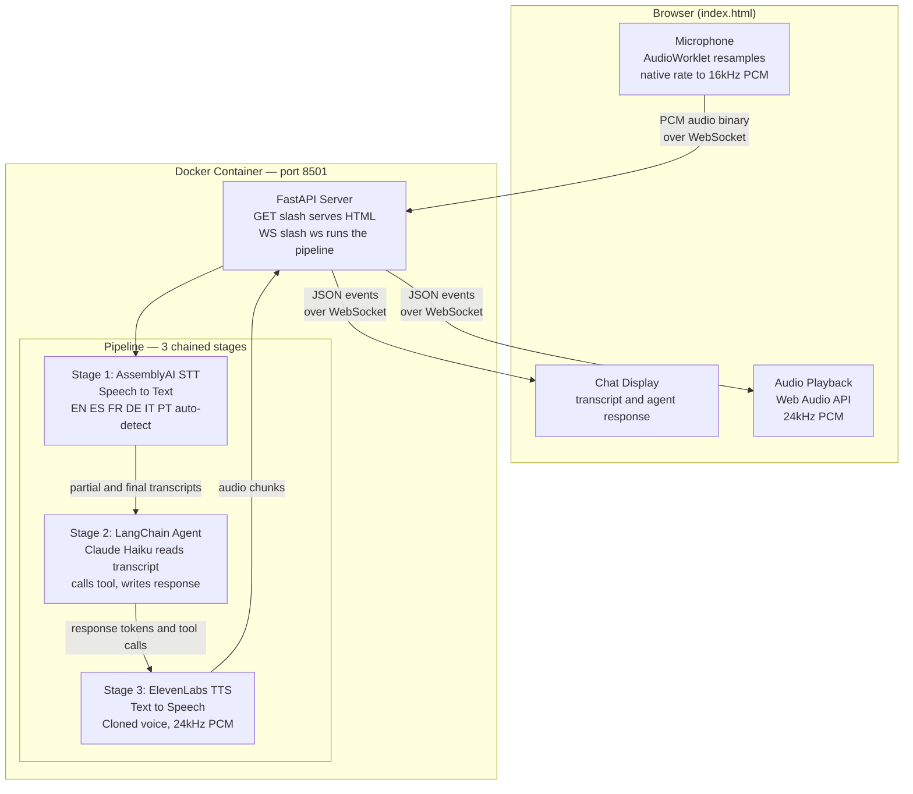
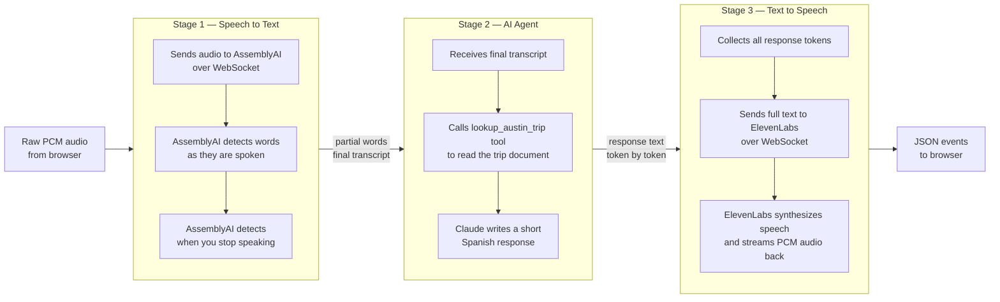
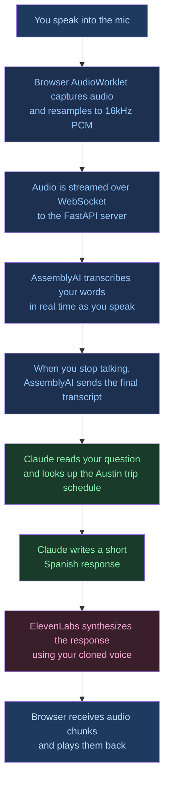
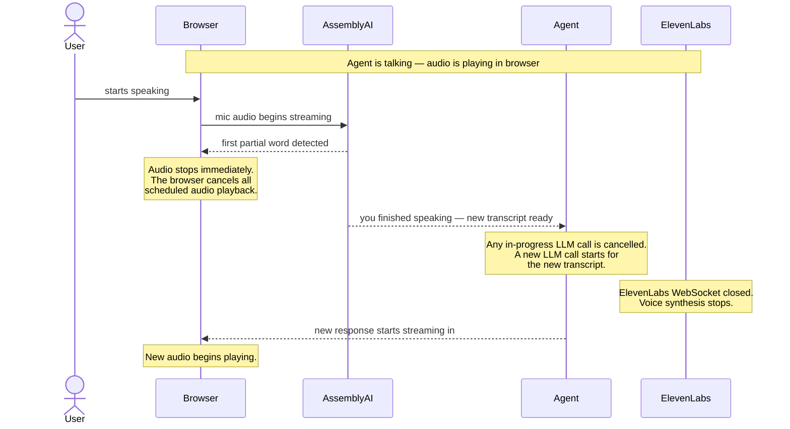

# Voice Agents — Architecture

## Agent 1: `langchain-assembly-11labs-pipeline`

**Pattern:** STT → Agent → TTS ("The Sandwich")
**Status:** Working

---

## What This Does

This is a real-time voice agent. You speak into your browser microphone, the system transcribes what you said, an AI agent generates a response, and you hear the response spoken back in a cloned voice — all happening in a few seconds, end to end. The agent answers questions about a synthetic Austin, TX trip schedule and always responds in Spanish.

---

## System Architecture

The system has two main parts: a **browser** that handles your microphone and audio playback, and a **Docker container** that runs the entire backend pipeline.



The browser and the container talk through a single **WebSocket connection**. The browser sends raw audio frames in one direction, and receives a stream of JSON events in the other direction. Those events carry everything: partial transcripts, agent response tokens, and base64-encoded audio chunks.

---

## The Pipeline in Detail

The pipeline is the heart of the system. It is built from three stages chained together. Each stage receives a stream of events, does its job, and passes an enriched stream to the next stage. The whole thing runs as a single async generator chain — data flows through continuously without any intermediate buffering or waiting.



### Stage 1 — AssemblyAI Speech to Text

AssemblyAI runs a `universal-streaming-multilingual` model that automatically detects the language being spoken (English, Spanish, French, German, Italian, Portuguese). You do not need to configure which language to use — it figures it out from your voice.

The audio is streamed as raw 16kHz 16-bit PCM over a WebSocket. AssemblyAI sends back partial transcripts as you speak (so the UI updates in real time) and then sends a final transcript with an `end_of_turn` flag once it detects you have stopped talking.

### Stage 2 — LangChain Agent

The agent is built with LangChain's `create_agent` (a ReAct agent powered by LangGraph). It uses Claude Haiku as the language model and has one tool: `lookup_austin_trip`, which simply returns the full contents of `docs/austin_trip.md`.

When the agent receives your transcript, it calls the tool to load the trip document, reads it, and writes a concise 1–3 sentence response in Spanish. The response is plain text with no markdown because it will be spoken aloud.

The agent runs as a **background task** — it does not block the pipeline while the LLM is thinking. This means the system can still react to new speech (like you interrupting) even while the LLM is mid-response.

### Stage 3 — ElevenLabs Text to Speech

Once the agent finishes, the full response text is sent to ElevenLabs over a WebSocket. ElevenLabs synthesizes the speech using your configured voice (a cloned voice by default) and streams back 24kHz PCM audio in chunks. Each chunk is base64-encoded and sent to the browser as a `tts_chunk` JSON event.

The browser receives each chunk, decodes it, and schedules it for sequential playback using the Web Audio API. The audio plays with no gaps between chunks.

---

## What Happens When You Speak



---

## Interrupt Handling

One of the more complex behaviors is **interruption** — what happens when you start speaking while the agent is still talking. The system handles this gracefully at three layers simultaneously.



**Three things happen simultaneously when you speak:**

1. **In the browser** — the moment your first word arrives back from AssemblyAI, `stopTTS()` is called. This cancels all scheduled Web Audio nodes and sets a `ttsBlocked` flag so that any audio chunks still in-flight from ElevenLabs are silently dropped.

2. **In the agent stage** — when AssemblyAI confirms you have finished speaking, any in-progress LLM call is cancelled (the `asyncio.Task` is cancelled) and a new one starts immediately for your new transcript.

3. **In the TTS stage** — when the new transcript arrives, the ElevenLabs WebSocket is closed mid-stream. This stops voice synthesis immediately. The partial response buffer is discarded.

The reason interrupts work at all is that the agent runs as a **background async task**, not inline in the pipeline. If the LLM call blocked the pipeline, STT events from your new speech would queue up behind the old LLM call and arrive too late to be useful. By running it in the background, STT events flow through immediately regardless of what the LLM is doing.

---

## Browser Audio Handling

The browser does more than just send audio — it also handles microphone quality and audio playback.

**Mic capture with echo cancellation.** When you request microphone access, the browser is asked for `echoCancellation: true`, `noiseSuppression: true`, and `autoGainControl: true`. The most important of these is echo cancellation: without it, the microphone picks up the TTS audio coming from your speakers and sends it back to AssemblyAI, confusing the speech recognition. With echo cancellation enabled, the browser filters out the speaker output before sending audio to the pipeline.

**Sample rate resampling.** Browsers capture audio at their native sample rate (44.1kHz or 48kHz depending on the hardware). AssemblyAI requires 16kHz. An `AudioWorklet` running in a dedicated audio thread performs the downsampling: for each 16kHz output sample, it reads the proportionally corresponding input sample and converts from float32 to int16 PCM. This all happens on a separate thread so it never blocks the main page.

**Gapless TTS playback.** Each `tts_chunk` event from ElevenLabs carries a chunk of PCM audio. The browser schedules each chunk as a `AudioBufferSourceNode` starting precisely at the end of the previous one using a `nextPlayTime` cursor. This ensures continuous, gapless playback even across many small chunks.

---

## Components Reference

### `src/server.py` — FastAPI Server

Two routes:
- `GET /` returns `src/static/index.html`
- `WS /ws` accepts a WebSocket, wraps incoming binary frames as an async generator, feeds it into `pipeline.atransform()`, and streams all output events back as JSON

Each WebSocket connection is a fully independent pipeline with no shared state.

### `src/pipeline.py` — The Pipeline

Three `RunnableGenerator` stages chained with `|`. Each stage is an async generator function. The `merge_async_iters` utility allows two async generators inside a single stage to run concurrently — this is how the TTS stage can receive ElevenLabs audio at the same time as it is forwarding events from the agent.

### `src/assemblyai_stt.py` — Speech to Text

Manages the AssemblyAI WebSocket lifecycle. Buffers audio to 200ms chunks before sending (above AssemblyAI's 50ms minimum). Waits for a `Begin` message before sending any audio. Emits `STTChunkEvent` for partials and `STTOutputEvent` when `end_of_turn` is true.

### `src/agent.py` — LangChain Agent

Defines the LangChain ReAct agent, the `lookup_austin_trip` tool, and the system prompt. The system prompt instructs the agent to: use the tool before answering, respond in Spanish, keep answers to 1–3 sentences, and use plain text (no markdown).

### `src/elevenlabs_tts.py` — Text to Speech

Manages the ElevenLabs WebSocket lifecycle. Opens a fresh connection per turn. Sends text with `flush: true` for low-latency synthesis, then an empty string `""` as an end-of-stream signal. The `interrupt()` method closes the current connection without permanently shutting down, allowing a new connection on the next turn.

### `src/events.py` — Event Types

Typed Python dataclasses for every event in the pipeline. The `event_to_dict()` function serializes them to JSON for the WebSocket, base64-encoding any raw audio bytes.

### `src/utils.py` — Utilities

A single function: `merge_async_iters(*aiters)`. Takes multiple async iterators and merges them into one, yielding items from whichever iterator produces first. Built on `asyncio.TaskGroup` and an `asyncio.Queue`.

### `src/static/index.html` — Browser UI

A self-contained HTML page with no external dependencies. All JavaScript is inline. Handles mic capture via `AudioWorklet`, WebSocket communication, conversation display, and TTS audio playback via the Web Audio API.

---

## File Structure

```
voice-agents/
├── CLAUDE.md                              project rules for Claude Code
├── Architecture.md                        this document
├── .gitignore
└── langchain-assembly-11labs-pipeline/
    ├── Dockerfile                         python:3.11-slim, uv, uvicorn with hot reload
    ├── docker-compose.yml                 single service on port 8501
    ├── pyproject.toml                     python dependencies
    ├── .env                               API keys (gitignored)
    ├── .env.example                       template for API keys
    ├── docs/
    │   └── austin_trip.md                 trip schedule — the agent's knowledge base
    └── src/
        ├── server.py                      FastAPI app
        ├── pipeline.py                    3-stage streaming pipeline
        ├── agent.py                       LangChain agent and tool
        ├── assemblyai_stt.py              AssemblyAI WebSocket client
        ├── elevenlabs_tts.py              ElevenLabs WebSocket client
        ├── events.py                      typed event dataclasses
        ├── utils.py                       merge_async_iters
        └── static/
            └── index.html                 browser UI
```

---

## Environment Variables

| Variable | Required | Description |
|----------|----------|-------------|
| `ASSEMBLYAI_API_KEY` | Yes | AssemblyAI streaming API key |
| `ANTHROPIC_API_KEY` | Yes | Claude API key |
| `ELEVENLABS_API_KEY` | Yes | ElevenLabs API key |
| `ELEVENLABS_VOICE_ID` | Yes | Voice ID — use your cloned voice |
| `LANGCHAIN_API_KEY` | Optional | LangSmith tracing key |
| `LANGCHAIN_TRACING_V2` | Optional | Set `true` to enable LangSmith traces |
| `LANGCHAIN_PROJECT` | Optional | LangSmith project name |

---

## How to Run

```bash
cd langchain-assembly-11labs-pipeline
cp .env.example .env       # fill in your API keys
docker compose up --build  # first run — builds the image
docker compose up          # subsequent runs
```

Open **http://localhost:8501**, click **Start**, allow microphone access, and speak.
